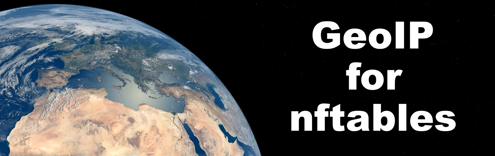

## GeoIP for nftables

### Introduction

&nbsp; &nbsp;***GeoIP for nftables*** is a Bash script to create nftables sets of country specific IP address ranges for use with firewall rulesets. The project provides a simple and flexible way to implement GeoIP filtering with [nftables](https://netfilter.org/projects/nftables/).

### Features

* A script written for the popular [Bash](https://en.wikipedia.org/wiki/Bash_%28Unix_shell%29) shell.
* Easy to set up, configure and customize with source code that's heavily commented.
* Uses the free GeoIP database from db-ip.com (no EULA to accept).
* Automatically generates country-specific nftables address range sets.
* The script has a small memory footprint to run well on systems with limited RAM. A flexible configuration allows loading only minimum sets required if memory is tight.
* User settings are stored in a standard configuration file rather than using command line arguments.
* Packets can be GeoIP filtered with a single nftables rule rather than two rules to mark and match packets like nftables map based solutions.
* The script allows access to all of the valid country code address ranges in the database.
* Automatically determines your installed version of nftables and recommends the correct "include" statements for your ruleset. The script also creates "include-all" files to allow you to include all GeoIP sets with a single reference on older versions of nftables that don't support include wildcards.
* The [User Guide](https://github.com/wirefalls/geoip/wiki/User-Guide) explains how to define all element definitions for GeoIP sets in one file, eliminating the chance of having out-of-sync definitions in multiple files when flushing and refilling sets with new data.
* Simplified directory structure to shorten "include" path names.
* The script creates ~500 IPv4 and IPv6 set files from the GeoIP database in about 10 seconds on a low power quad-core 2200ge server with SSD storage.
* Tested on [Ubuntu Server](https://ubuntu.com/server), [Fedora Server](https://getfedora.org/en/server/), and [Raspberry Pi OS](https://www.raspberrypi.org/downloads/raspberry-pi-os/).

If you find ***GeoIP for nftables*** useful, please consider giving us a **Star** at the top of the page.

### Getting Started

#### Documentation

Please see the [Wiki](https://github.com/wirefalls/geoip/wiki/Home) for the latest documentation.

#### Installation
The [Installation Guide](https://github.com/wirefalls/geoip/wiki/Installation-Guide) has detailed installation instructions to get you up and running.

#### Usage
The [User Guide](https://github.com/wirefalls/geoip/wiki/User-Guide) explains how to configure your ruleset for GeoIP filtering.

#### Discussions
Please see our [Discussions Page](https://github.com/wirefalls/geoip/discussions) to share ideas or ask questions about ***GeoIP for nftables***.
&nbsp;
### License
***GeoIP for nftables*** is licensed under the [GNU GPLv2](./LICENSE) (or at your option, any later version).

### Contributing
* You can help us by spreading the good word about ***GeoIP for nftables*** online.
* Please see the [Contributing Guide](https://github.com/wirefalls/geoip/wiki/Contributing) for more information on how you can help.
* If you're a package maintainer, feel free to contact us if you have any questions.

### Credits
##### Maintainer
* Wirefalls - [GitHub.com/wirefalls](https://github.com/wirefalls)

Please see the ***GeoIP for nftables*** [Copyright Notice](https://github.com/wirefalls/geoip/wiki/Copyright).  
Special thanks to the [nftables project](https://netfilter.org/projects/nftables/) for creating a robust firewall framework.  
[IP Geolocation by DB-IP - https://db-ip.com](https://db-ip.com)  
Raspberry Pi is a trademark of the [Raspberry Pi Foundation](https://www.raspberrypi.org/).  
Photos used to create the ***GeoIP for nftables*** header image courtesy of [NASA Visible Earth](https://visibleearth.nasa.gov).  
All trademarks, logos and copyrights are the property of their respective owners.  

### References

https://netfilter.org/projects/nftables/  
https://wiki.nftables.org/wiki-nftables/index.php/Main_Page  
http://netfilter.org/mailinglists.html#ml-user  
https://en.wikipedia.org/wiki/ISO_3166-1_alpha-2  
https://db-ip.com/db/lite.php  
https://db-ip.com/faq.php  
https://unstats.un.org/unsd/methodology/m49/overview  
